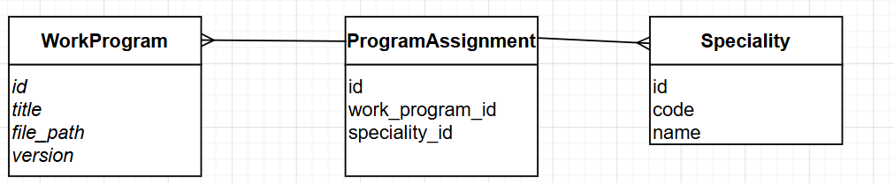

# Отчет по учебному проекту
## Сервис рабочих программ (Вариант 13)

### Функционал сервиса
* Регистрация и хранение рабочих программ дисциплин (РПД).
* Привязка программ к специальностям и конкретным дисциплинам.
* Учет версий программ и путей к файлам.
* Правила валидации: поля не могут быть пустыми (Not NULL), уникальность связки "программа + версия".

---

### Добавить рабочую программу
Информация, требуемая для создания:

| Параметр | Обязательность | Тип | Ограничение | Значение по умолчанию |
| :--- | :--- | :--- | :--- | :--- |
| title | Да | string | Не пустое | — |
| file_path | Да | string | Не пустое | — |
| version | Да | string | Формат x.x | "1.0" |

**Уникальные комбинации:** `title` + `version`.

Информация, возвращаемая в случае удачного создания (полный объект из БД):
| Параметр | Тип | Описание |
| :--- | :--- | :--- |
| id | int | Уникальный идентификатор записи |
| title | string | Сохраненное название программы |
| file_path | string | Сохраненный путь к файлу |
| version | string | Сохраненная версия программы |
| created_at | datetime | Дата и время создания |

---

### Изменить рабочую программу по ID
Информация, требуемая для изменения по ID:

| Параметр | Обязательность | Тип | Ограничение | Значение по умолчанию |
| :--- | :--- | :--- | :--- | :--- |
| title | Нет | string | Не пустое | — |
| file_path | Нет | string | Не пустое | — |

Информация, возвращаемая в случае удачного изменения (обновленный объект целиком):
| Параметр | Тип | Описание |
| :--- | :--- | :--- |
| id | int | Идентификатор программы |
| title | string | Обновленное название |
| file_path | string | Обновленный путь к файлу |
| version | string | Текущая версия |

---

### Удаление рабочей программы по ID
Вернет **True**, если сущность была успешно удалена из БД, иначе вернет **False**.

---

### Получить рабочую программу по ID
Информация, возвращаемая в случае удачного поиска по ID:

| Параметр | Тип | Описание |
| :--- | :--- | :--- |
| id | int | Идентификатор |
| title | string | Название программы |
| file_path | string | Путь к файлу |
| version | string | Версия |

---

### Получить список рабочих программ по заданным параметрам
Информация, требуемая для получения списка:
| Параметр | Тип | Описание |
| :--- | :--- | :--- |
| title | string | Поиск по названию программы |

Информация возвращается в виде списка объектов:
| Параметр | Тип |
| :--- | :--- |
| id | int |
| title | string |
| version | string |

---

### ER-диаграмма
Диаграмма разработана в соответствии с требованиями 3НФ. Связь "Многие-ко-многим" (Many-to-Many) между сущностями **WorkProgram** и **Specialty** реализована через транзитивную таблицу **ProgramAssignment**.

---

### Порядок предоставления отчёта
1. Создана вилка репозитория.
2. В репозитории создана папка S13.
3. Файл `doc.md` содержит описание функций и структуру данных.
4. Файл `models.py` содержит модели БД на Peewee и функцию инициализации.

